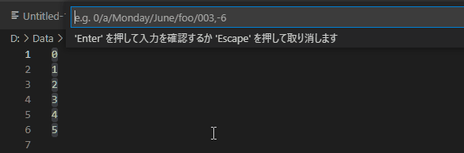

# Insert Sequence




* Insert sequence at cursors.
カーソル位置に連番を入力します。

# Examples

<!-- ## Insert sequence numbers -->
## Numbers

<!-- * 数字を入力すると、数字の連番を入力します。 -->

input `5`
```
5
6
7
```

<!-- * 頭に0を付けると、0埋めされます。 -->

## Padding
input `05`
```
05
06
07
```


<!-- ## Insert sequence chars -->
## Alphabets

<!-- * アルファベット1文字を指定すると、アルファベットの連番を入力できます。 -->

input `x`
```
x
y
z
```

## Others
<!-- ## Insert sequence somethings -->
<!-- * 曜日,月名,メタ構文変数の入力を入力できます。 -->

input `June`
```
June
July
August
```

input `foo`
```
foo
bar
baz
```

Sequence is configurable. Search for `sequence-number` in the configuration.


By default the following are available.

months

```
January,February,March,April,May,June,July,August,
September,October,November,December,
```
```
Jan.,Feb.,Mar.,Apr.,May,Jun.,Jul.,Aug.,Sep.,Oct.,Nov.,Dec.
```

days
```
Sunday,Monday,Tuesday,Wednesday,Thursday,Friday,Saturday
```
```
Sun.,Mon.,Tue.,Wed.,Thu.,Fri.,Sat.
```

metasyntactic variable

```
foo,bar,baz,qux,quux,corge,grault,garply,waldo,fred,plugh,xyzzy,thud
```

```
hoge,fuga,piyo,hogera,hogehoge
```

Dummy Nmaes
```
Alice,Bob,Carol,Dave,Ellen,Frank
```


<!-- * カンマ等で区切ることで、ステップ数を指定できます。 -->
  <!-- * 区切りは、カンマ,コロン,スペースが使えます。 -->

## Step

* For specify step, separate with comma,colon,space.

input `5,5`
```
5
10
15
```

input `Monday 2`
```
Monday
Wednesday
Friday
```

# Commands
* insert-sequence.execute
  * Default keymap : none


# Link

* [GitHub](https://github.com/kuone314/VSCodeExtensionInsertSequence)
* [Twitter](https://twitter.com/KuoneTech)
